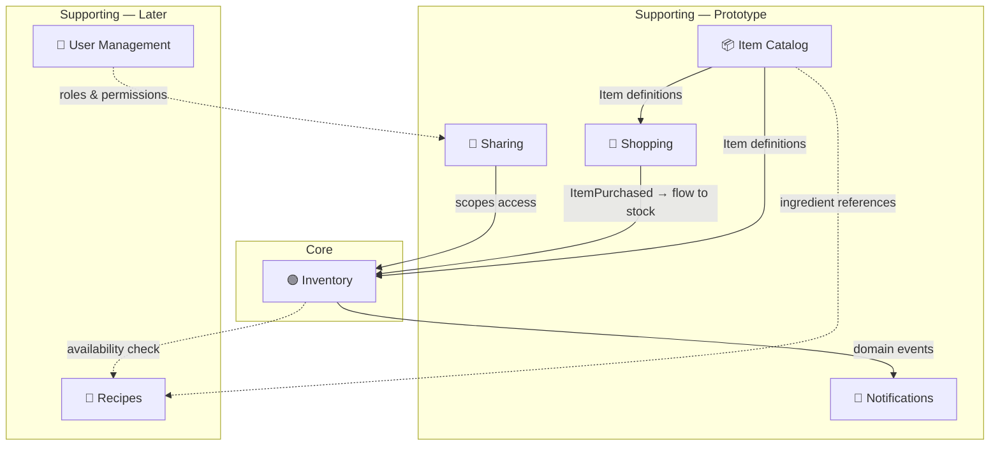

# Bounded Contexts — Stash App

## Overview

The Stash App helps households track inventory, shop efficiently, and reduce waste. The domain is divided into **seven bounded contexts**, five for the prototype phase and two planned for later.

> [!NOTE]
> Solid lines = prototype scope. Dashed lines = future scope.

---

## 1. 🟢 Inventory (Core Domain)

**Purpose**: *"What do we have, how much, and how long will it stay good?"*

This is the heart of the application. It tracks **individual instances** of items in stock — not aggregated totals.

### Key Concepts

| Concept | Description |
|---|---|
| **InventoryEntry** | A single physical instance of an item in stock (e.g., one carton of milk) |
| **Quantity** | How much remains (value object with amount + unit) |
| **ShelfLife** | Estimated remaining shelf life, adjusted when opened |
| **ExpirationDate** | When the item expires (sealed) |
| **OpenedAt** | Timestamp when the item was opened |
| **StorageLocation** | A hierarchical tree of physical storage spots within a SharedLocation (e.g., Kitchen → Pantry → Top Shelf). Allows precise item tracking even in large storage areas |

### Responsibilities
- Adding new items to stock (manually, from shopping flow, future: barcode scan)
- Tracking usage — recording when an item is opened, partially consumed, or finished
- Calculating remaining shelf life — adjusting based on opened state (future: dynamic algorithm)
- Removing depleted or expired items

### Example Events
- `InventoryEntryAdded`
- `InventoryEntryOpened`
- `InventoryEntryConsumed` (partial or full)
- `InventoryEntryRemoved`
- `InventoryEntryAdjusted`

### Design Notes
> Each **individual unit** is tracked separately. Three cartons of milk = three InventoryEntries, each with their own opened state, quantity remaining, and shelf life. This enables accurate expiry tracking and future algorithmic shelf life predictions.

---

## 2. 📦 Item Catalog (Supporting)

**Purpose**: *"What things exist, and what are their default properties?"*

Provides the **template definitions** that Inventory and Shopping reference. Named "Item Catalog" (not "Product Catalog") because not everything is a purchased product — homemade items (e.g., a jar of jam from hand-picked berries) are valid catalog entries.

### Key Concepts

| Concept | Description |
|---|---|
| **CatalogItem** | A definition/template of a thing (product or homemade) |
| **Category** | Grouping (dairy, canned goods, homemade, etc.) |
| **DefaultUnit** | The standard unit for this item (liters, grams, pieces) |
| **DefaultShelfLife** | Typical sealed shelf life |
| **DefaultShelfLifeAfterOpening** | Typical shelf life once opened |
| **Barcode** | Optional product identifier (future: for scanning) |

### Responsibilities
- Managing item definitions (create, update, delete)
- Providing default values when adding items to inventory
- Future: barcode lookup, community-shared item database

### Example Events
- `CatalogItemCreated`
- `CatalogItemUpdated`
- `CatalogItemRemoved`

### Relationship to Inventory
Inventory holds a **reference** to a CatalogItem (by ID), but InventoryEntry is **not** dependent on the catalog — values are copied at creation time. If the catalog entry is updated, existing inventory entries are unaffected.

---

## 3. 🛒 Shopping (Supporting)

**Purpose**: *"What do we need to buy?"*

A separate lifecycle from Inventory. Shopping lists can include items not tracked in inventory, and the act of purchasing has its own workflow.

### Key Concepts

| Concept | Description |
|---|---|
| **ShoppingList** | A list of items to purchase |
| **ShoppingListItem** | An entry on the list, optionally linked to a CatalogItem |
| **PurchaseRecord** | The act of buying — triggers flow to Inventory |

### Responsibilities
- Managing shopping lists (add, remove, reorder items)
- Marking items as purchased
- Triggering the **Shopping → Inventory flow**: purchased items can seamlessly become InventoryEntries
- Future: auto-suggest items when inventory is low

### Key Integration: Shopping → Inventory Flow

> [!IMPORTANT]
> A core UX goal is making the transition from "bought" to "in stock" as **frictionless as possible**.
>
> When an item is marked as purchased, the system should pre-fill as much data as possible (from the CatalogItem defaults) so the user doesn't have to fill in fields manually. The user can still adjust details if needed.

### Example Events
- `ShoppingListCreated`
- `ItemAddedToShoppingList`
- `ItemMarkedAsPurchased` → triggers Inventory flow
- `ShoppingListCompleted`

---

## 4. 🤝 Sharing (Supporting)

**Purpose**: *"Who shares access to this inventory, and where?"*

Scopes inventory to a **physical location** (house, apartment, office) and the people who share access. This is explicitly **not** about "households" as a social construct — it's about shared access to a physical location's stock.

### Key Concepts

| Concept | Description |
|---|---|
| **SharedLocation** | A physical place (house, apartment) where inventory is kept |
| **Member** | A person with access to a SharedLocation's inventory |

### Responsibilities
- Creating and managing shared locations
- Adding/removing members
- Scoping all inventory to a specific SharedLocation

### Design Note
> Roles and permissions are explicitly **out of scope** for Sharing. If role-based access is needed in the future, it belongs in the **User Management** context. For now: everyone with access can do everything.

### Example Events
- `SharedLocationCreated`
- `MemberAdded`
- `MemberRemoved`

---

## 5. 🔔 Notifications (Supporting)

**Purpose**: *"Alert me when something needs attention."*

An independent context that listens to domain events from other contexts (primarily Inventory) and manages alerting rules.

### Key Concepts

| Concept | Description |
|---|---|
| **AlertRule** | A rule defining when to notify (e.g., "3 days before expiration") |
| **Notification** | A generated alert for the user |
| **NotificationPreference** | User preferences for channels and timing |

### Responsibilities
- Defining alert rules (expiration warnings, low stock, etc.)
- Generating and delivering notifications
- Managing notification preferences

### Example Events
- `AlertRuleCreated`
- `NotificationGenerated`
- `NotificationDismissed`

### Primary Trigger
Reacts to `InventoryEntry` events — particularly checking `ShelfLife` and `ExpirationDate` against configured `AlertRules`.

---

## 6. 👤 User Management (Later)

**Purpose**: *"Who are the users, and what can they do?"*

Deferred to a later phase. Handles authentication, user profiles, and role-based permissions.

---

## 7. 🍳 Recipes (Later)

**Purpose**: *"What can I make with what I have?"*

Deferred to a later phase. Recipe management linked to the Item Catalog and Inventory for availability checking.

---

## Context Map — Relationships

| Upstream | Downstream | Relationship | Description |
|---|---|---|---|
| Item Catalog | Inventory | Conformist | Inventory copies item defaults at entry creation |
| Item Catalog | Shopping | Conformist | Shopping references catalog items for list entries |
| Shopping | Inventory | Domain Events | `ItemMarkedAsPurchased` triggers inventory entry creation flow |
| Inventory | Notifications | Published Language | Inventory publishes events, Notifications subscribes |
| Sharing | Inventory | — | SharedLocation scopes which inventory a user sees |
| Item Catalog | Recipes *(later)* | Conformist | Recipes reference catalog items as ingredients |
| Inventory | Recipes *(later)* | Query | Recipes check current availability |
| User Management *(later)* | Sharing | ACL | Roles/permissions applied to shared location access |

> [!NOTE]
> **DDD Relationship patterns explained:**
> - **Conformist** — Downstream adopts the upstream model as-is, no translation needed
> - **Published Language** — Upstream defines a shared contract (events/schemas) that others subscribe to
> - **ACL (Anti-Corruption Layer)** — Downstream translates the upstream model into its own language to stay independent
> - **Domain Events** — Contexts communicate asynchronously through events

---

## Open Questions for Later Phases

### 1. Dynamic shelf life algorithm
How to estimate remaining shelf life after opening? Current thinking:
- Use an **LLM to look up typical shelf life after opening** for a given product type, since structured ML data for this doesn't readily exist
- No custom ML model needed — leverage existing knowledge via prompting
- Open: which LLM, caching strategy for lookups, and how to handle edge cases (homemade items)

### 2. Barcode scanning & product data
A hybrid approach:
- **Supermarket websites** (e.g., Albert Heijn, Jumbo) have product data publicly available — scraping or migrating this data is an option
- **External product APIs** (e.g., Open Food Facts) could supplement, but coverage and reliability varies
- Start with a **local catalog** that can be enriched over time via these sources

### 3. Conflict resolution
When two users modify the same InventoryEntry from different devices:
- Aim for a **simple, Dropbox-style approach** — e.g., last-writer-wins with conflict detection, or operational transforms for specific fields
- Keep it maintainable; avoid complex CRDT implementations unless proven necessary
- Relevant for the sync/local-first architecture in Fase 5
