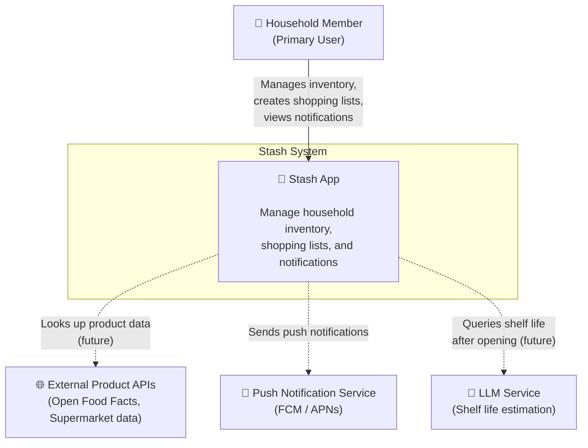
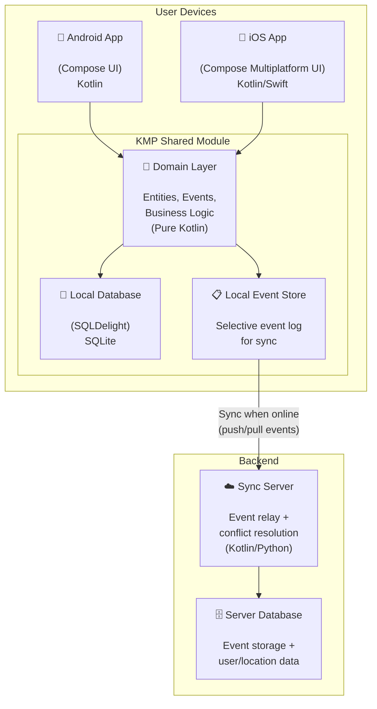
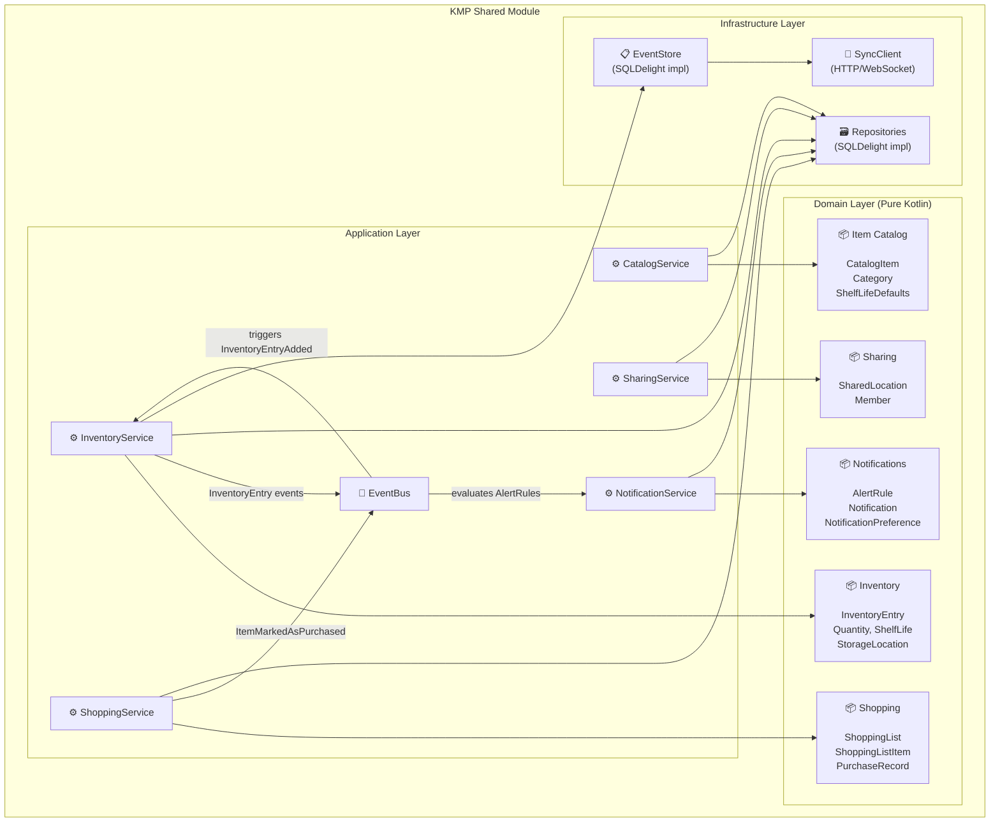

# C4 Architecture Model — Stash App

---

## Level 1: System Context Diagram

*Who uses the system, and what does it interact with?*

> [!NOTE]
> Dashed lines = future integrations. The app is designed to work **fully offline** without any external dependencies. External services only enrich the experience.

---

## Level 2: Container Diagram

*What are the major technical building blocks?*

### Container Descriptions

| Container | Technology | Purpose |
|---|---|---|
| **Android App** | Kotlin, Compose | Native Android UI shell |
| **iOS App** | KMP + Compose Multiplatform | Native iOS UI shell |
| **KMP Shared Module** | Kotlin Multiplatform | All shared business logic, domain model, and data access |
| **Local Database** | SQLDelight (SQLite) | On-device persistence — the app works fully offline |
| **Local Event Store** | SQLDelight (SQLite) | Selective event log for inventory mutations, used for sync |
| **Sync Server** | Kotlin (Ktor) or Python | Relays events between devices, handles conflict resolution |
| **Server Database** | PostgreSQL | Stores events and shared location/membership data |

---

## Level 3: Component Diagram — KMP Shared Module

*How is the shared module structured internally?*

### Layer Responsibilities

| Layer | Responsibility |
|---|---|
| **Domain** | Pure business logic — entities, value objects, events. No framework dependencies. |
| **Application** | Use cases / services — orchestrates domain objects, publishes events via EventBus. |
| **Infrastructure** | Technical implementations — database access, event store, network sync. |

---

## Design Decisions

### 1. Local-First Architecture

| Aspect | Decision |
|---|---|
| **What** | All data is stored locally first. The app is fully functional offline. |
| **Why** | A household inventory app must work instantly, even without internet. Users open the fridge and need to check/update stock in seconds. |
| **How** | SQLDelight provides a local SQLite database on each device. The sync server is only needed for multi-device/multi-user scenarios. |
| **Trade-off** | Adds complexity for sync and conflict resolution, but UX benefit is significant. |

### 2. Selective Event Sourcing

| Aspect | Decision |
|---|---|
| **What** | Only **inventory mutations** are stored as events. Other contexts use standard CRUD. |
| **Why** | Full event sourcing adds complexity everywhere. Inventory mutations are the only ones that need sync across devices and provide audit trail value. |
| **How** | The Local Event Store captures `InventoryEntryAdded`, `Opened`, `Consumed`, `Removed`, `Adjusted`. These events are synced to the server and replayed on other devices. |
| **Trade-off** | Simpler than full ES, but means Shopping and Catalog changes use last-writer-wins sync. Acceptable because inventory is the time-sensitive core. |

### 3. Kotlin Multiplatform (KMP)

| Aspect | Decision |
|---|---|
| **What** | Shared domain/application/data layer in Kotlin, platform-specific UI shells. |
| **Why** | Write business logic once, run on Android and iOS. Domain logic stays pure Kotlin with no platform dependencies. |
| **How** | KMP module contains domain, application, and infrastructure layers. Compose Multiplatform for shared UI. |
| **Trade-off** | KMP ecosystem is maturing but some libraries may lack iOS support. SQLDelight and Ktor are well-supported. |

### 4. Sync Strategy

| Aspect | Decision |
|---|---|
| **What** | Event-based sync with Dropbox-style conflict resolution. |
| **Why** | Simple, maintainable, fits the selective event sourcing approach. |
| **How** | Devices push local events to the server, pull remote events. For inventory: events are ordered by timestamp, last-writer-wins per field with conflict detection. For other contexts: standard last-writer-wins. |
| **Trade-off** | Not as robust as CRDTs, but much simpler to implement and debug. Acceptable for household-scale usage. |
| **Upgrade path** | Architecture allows upgrading to CRDTs or OT in a later phase if needed — the event-based foundation makes this possible without a full rewrite. |

### 5. Layered Architecture per Context

| Aspect | Decision |
|---|---|
| **What** | Clean separation: Domain → Application → Infrastructure. |
| **Why** | Domain layer stays testable and framework-free. Infrastructure can be swapped without affecting business logic. |
| **How** | Domain defines repository interfaces (ports). Infrastructure provides implementations (adapters). Application layer orchestrates via services. |
| **Trade-off** | More files/structure upfront, but pays off in testability and maintainability. |
