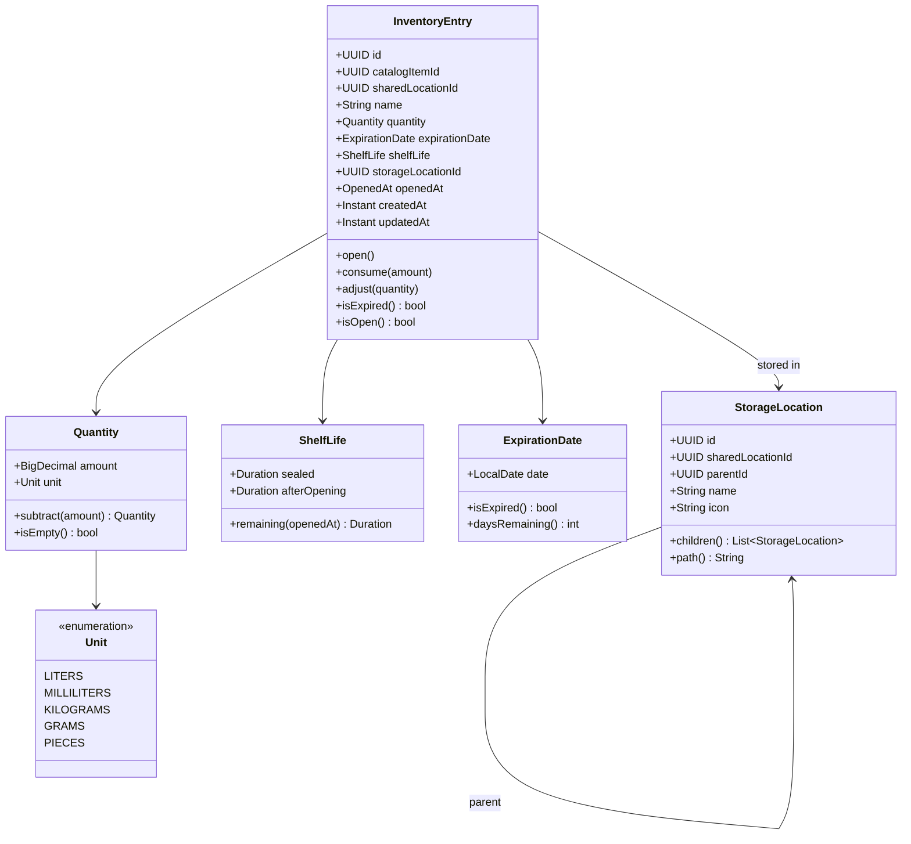
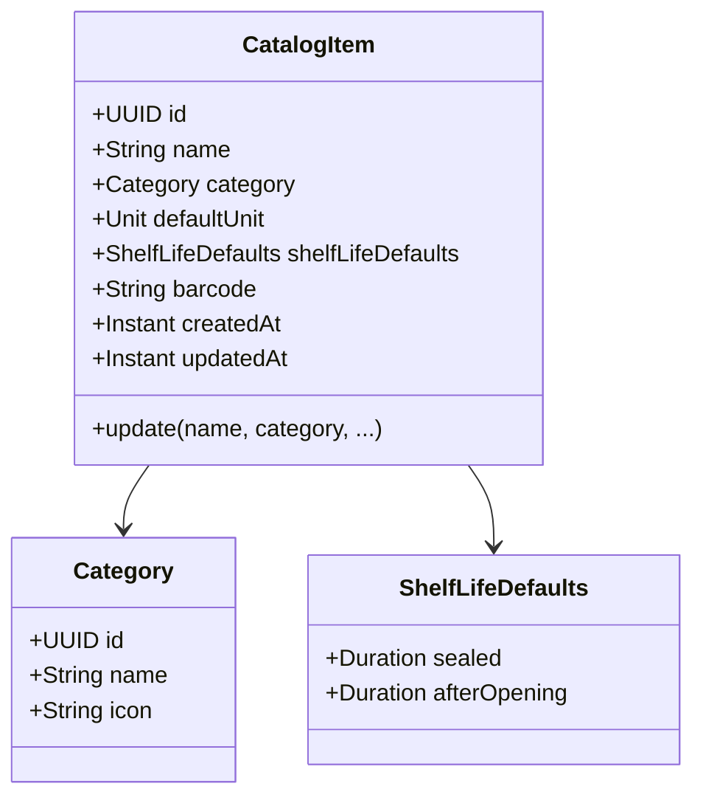
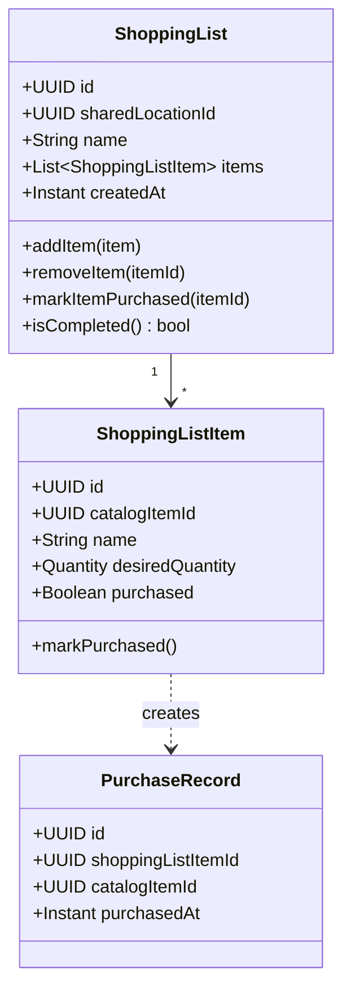
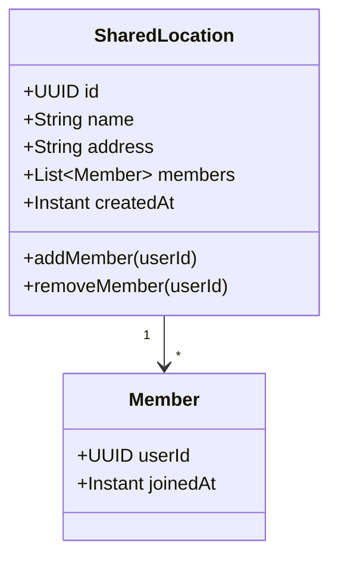
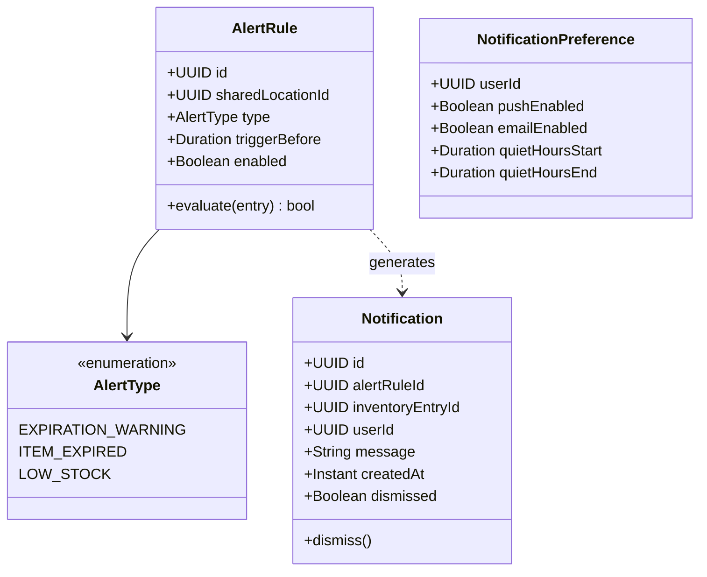

# Domain Model — Stash App

Entities, value objects, aggregates, and domain events per bounded context.

---

## 1. Inventory (Core Domain)

| Name | Type | Notes |
|---|---|---|
| **InventoryEntry** | Entity (Aggregate Root) | Uniquely identified, tracks one physical item instance |
| **Quantity** | Value Object | Immutable amount + unit pair |
| **Unit** | Value Object (Enum) | Measurement units |
| **ShelfLife** | Value Object | Sealed + after-opening durations |
| **ExpirationDate** | Value Object | Wraps date with expiry logic |
| **StorageLocation** | Entity | Hierarchical tree of physical spots within a SharedLocation (e.g., Kitchen → Pantry → Top Shelf). Self-referential via `parentId` |

### Domain Events

| Event | Payload | Trigger |
|---|---|---|
| `InventoryEntryAdded` | `entryId`, `catalogItemId`, `sharedLocationId`, `name`, `quantity`, `expirationDate`, `storageLocation` | User adds item to stock |
| `InventoryEntryOpened` | `entryId`, `openedAt`, `newShelfLife` | User marks item as opened |
| `InventoryEntryConsumed` | `entryId`, `amountConsumed`, `remainingQuantity` | User records usage |
| `InventoryEntryRemoved` | `entryId`, `reason` (depleted/discarded/expired) | User removes item |
| `InventoryEntryAdjusted` | `entryId`, `changes` (map of changed fields) | User corrects item details |

---

## 2. Item Catalog (Supporting)

| Name | Type | Notes |
|---|---|---|
| **CatalogItem** | Entity (Aggregate Root) | Template for inventory entries and shopping list items |
| **Category** | Entity | Grouping of catalog items. Separate entity so categories can be managed independently |
| **ShelfLifeDefaults** | Value Object | Default sealed + after-opening shelf life for this item type |

### Domain Events

| Event | Payload | Trigger |
|---|---|---|
| `CatalogItemCreated` | `itemId`, `name`, `category`, `defaultUnit`, `shelfLifeDefaults`, `barcode` | User creates a new item definition |
| `CatalogItemUpdated` | `itemId`, `changes` | User modifies item properties |
| `CatalogItemRemoved` | `itemId` | User deletes an item definition |

---

## 3. Shopping (Supporting)

| Name | Type | Notes |
|---|---|---|
| **ShoppingList** | Entity (Aggregate Root) | A list scoped to a SharedLocation |
| **ShoppingListItem** | Entity | Entry on list. `catalogItemId` is optional — allows items not in the catalog |
| **PurchaseRecord** | Value Object | Records the purchase event, triggers Shopping → Inventory flow |

### Domain Events

| Event | Payload | Trigger |
|---|---|---|
| `ShoppingListCreated` | `listId`, `sharedLocationId`, `name` | User creates a new list |
| `ItemAddedToShoppingList` | `listId`, `itemId`, `catalogItemId`, `name`, `desiredQuantity` | User adds item to list |
| `ItemRemovedFromShoppingList` | `listId`, `itemId` | User removes item from list |
| `ItemMarkedAsPurchased` | `listId`, `itemId`, `catalogItemId`, `purchasedAt` | User marks item as bought → triggers Inventory flow |
| `ShoppingListCompleted` | `listId` | All items on list are purchased |

---

## 4. Sharing (Supporting)

| Name | Type | Notes |
|---|---|---|
| **SharedLocation** | Entity (Aggregate Root) | The physical location that scopes all inventory |
| **Member** | Value Object | A user reference within a SharedLocation. No roles for now |

### Domain Events

| Event | Payload | Trigger |
|---|---|---|
| `SharedLocationCreated` | `locationId`, `name`, `address`, `createdByUserId` | User creates a new location |
| `MemberAdded` | `locationId`, `userId` | User invites someone to share |
| `MemberRemoved` | `locationId`, `userId` | User removes a member |

---

## 5. Notifications (Supporting)

| Name | Type | Notes |
|---|---|---|
| **AlertRule** | Entity (Aggregate Root) | Defines when to generate notifications per SharedLocation |
| **AlertType** | Value Object (Enum) | Types of alerts the system supports |
| **Notification** | Entity | A generated alert instance for a specific user |
| **NotificationPreference** | Entity | Per-user notification settings |

### Domain Events

| Event | Payload | Trigger |
|---|---|---|
| `AlertRuleCreated` | `ruleId`, `sharedLocationId`, `type`, `triggerBefore` | User configures an alert |
| `AlertRuleUpdated` | `ruleId`, `changes` | User modifies alert settings |
| `NotificationGenerated` | `notificationId`, `alertRuleId`, `inventoryEntryId`, `userId`, `message` | AlertRule condition met |
| `NotificationDismissed` | `notificationId` | User dismisses a notification |

---

## 6–7. Future Contexts (User Management & Recipes)

Detailed models deferred. High-level shape:

### User Management
- **User** (Entity): `id`, `email`, `displayName`, authentication details
- **Role** (Value Object): permission sets per SharedLocation

### Recipes
- **Recipe** (Entity, Aggregate Root): `id`, `name`, `instructions`, list of Ingredients
- **Ingredient** (Value Object): reference to `CatalogItem` + required `Quantity`
- Query Inventory for **availability** checking
